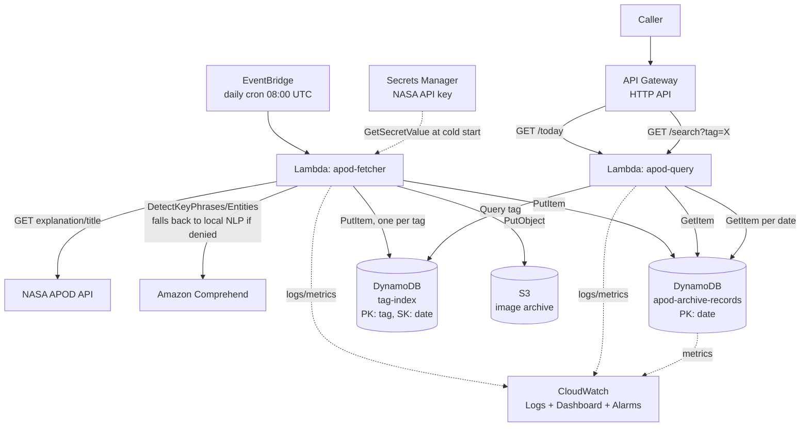

# Architecture Review — NASA APOD Archive & Intelligent Tagger

**Team:** Error_404 · **Author:** Sivanesh Mathavan Nadar · **Stack:** Terraform, AWS (us-east-1)

---

## Architecture

**8 AWS services:** Lambda (×2), API Gateway, DynamoDB (×2 tables), S3, Secrets Manager, EventBridge, Comprehend (with graceful fallback), CloudWatch.

---

## Three Decisions

**1. DynamoDB (on-demand) over RDS**
RDS wins on ad-hoc SQL joins and complex queries, but it costs money while idle and needs a VPC, subnet groups, and patching to manage. DynamoDB on-demand bills per request with zero idle cost, which fits both the daily-batch access pattern and the $100 budget.
*Pillar: Cost Optimization.*

**2. Serverless (Lambda + EventBridge) over an always-on EC2/container worker**
An EC2 instance or ECS task wins on cold-start latency and long-running jobs, but a container that mostly sits idle 23 hours and 59 minutes a day is wasted spend and an unpatched attack surface. Lambda + EventBridge runs the ~30-second daily job and briefly-lived query requests without a server to maintain.
*Pillar: Cost Optimization / Operational Excellence.*

**3. Sparse tag-index table (Query) over full-table Scan for tag search**
A GSI directly on the `tags` attribute was the original plan, but DynamoDB GSI keys must be scalar — `tags` is a List, so that's not possible. A Scan-with-filter was the first working fallback, but it re-reads the entire archive on every search, which gets worse (both latency and cost) as the archive grows. Instead, `apod-fetcher` writes one lightweight `{tag, date}` item per tag into a second table, and `apod-query` does an O(1) partition `Query` against it, then fetches only the matching full records.
*Pillar: Performance Efficiency.*

---

## Findings — Accept or Push Back

| # | Finding | Response |
|---|---|---|
| 1 | Tag search does a full table Scan; won't hold up as the archive grows past a few thousand items. | **Accept — fixed.** See commit: added a sparse tag-index table, written by the fetcher and queried (not scanned) by apod-query. |
| 2 | Both Lambdas run under a shared, broadly-permissioned `LabRole` instead of least-privilege per-function roles. | **Push back.** This is an AWS Academy Learner Lab constraint (`iam:CreateRole`/`iam:PutRolePolicy` are denied to the student), not a design choice. The Terraform already defines tight, per-function least-privilege roles (`modules/lambda`) and uses them automatically whenever `lab_role_arn` is left unset in a normal AWS account. |
| 3 | CloudWatch alarms exist but have no `alarm_actions` (SNS topic), so a failed daily fetch goes undetected until someone opens the dashboard. | **Accept — real gap**, not yet fixed in this pass. Next step: add an SNS topic + email subscription and wire it into both `aws_cloudwatch_metric_alarm` resources. |
| 4 | S3 bucket has `force_destroy = true` and no versioning — cheap, but risks silent, unrecoverable data loss. | **Push back for now.** Intentional trade-off for a $5-budget capstone in a lab account that resets anyway. Would flip to versioned + `force_destroy = false` before any production use. |
| 5 | The API Gateway base URL output includes a trailing slash, producing a doubled slash (`//today`) when endpoints are built by concatenation. | **Accept — cosmetic bug**, not yet fixed in this pass. Trivial fix: strip the trailing slash in the `api_base_url` output or in each dependent output. |

---

## Fix applied this pass

**Finding #1** (Scan won't scale) is fixed in this commit:
- `modules/dynamodb/table.tf` — tag-index table's purpose documented as active, not optional.
- `main.tf` — both Lambdas now receive `TAG_INDEX_TABLE_NAME` and IAM permissions for it.
- `src/apod_fetcher/handler.py` — writes one `{tag, date}` item per tag after each archive write.
- `src/apod_query/handler.py` — `/search` now does a `Query` on the tag-index table (falls back to the old Scan only if the table isn't configured, for backward compatibility).
